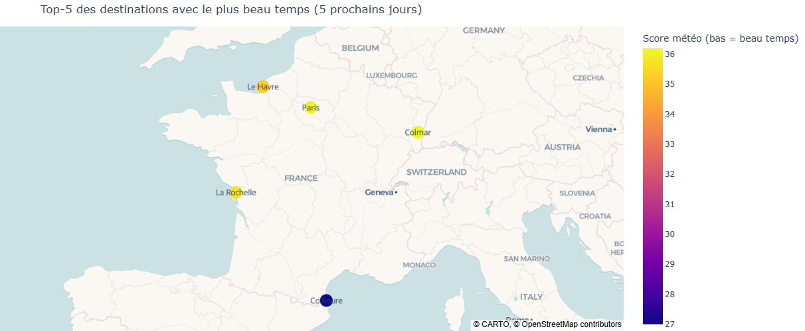
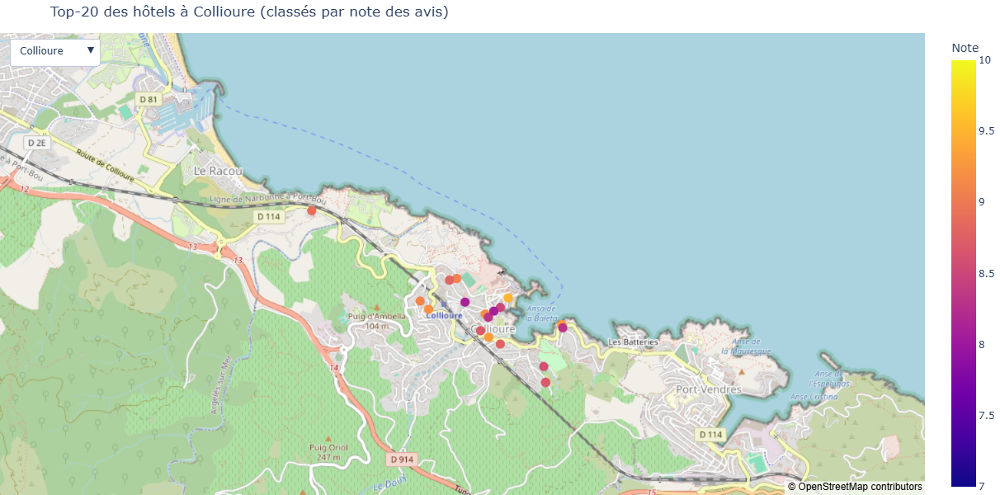

# Projet Kayak : où partir en vacances en France ?

Projet du bloc 1 : à partir de la météo et des hôtels de 35 villes françaises, recommander les destinations qui ont le plus beau temps et afficher leurs meilleurs hôtels.

📁 Dépôt GitHub du projet : [mes_projets_jedha_dsft36 / Bloc1_Data_Infrastructure](https://github.com/sandrinehardy/mes_projets_jedha_dsft36/tree/main/Bloc1_Data_Infrastructure)

## Par où commencer

1. `SHY_Kayak_bloc_1.pdf` : le notebook exécuté, avec toutes ses sorties (lecture rapide).
2. `carte1_Top5_destinations.png` et `carte2_hotels.png` : les deux cartes (images). Les cartes interactives ne s'exportent pas dans le PDF, elles sont donc fournies à part.
3. `SHY_Kayak_bloc_1.ipynb` : le notebook complet, avec le code et les sorties enregistrées.
4. Les captures AWS (bucket S3 et base PostgreSQL sur RDS) sont visibles dans le PDF et dans les sorties du notebook.

## Contenu du dossier

| Fichier | Rôle |
| --- | --- |
| `SHY_Kayak_bloc_1.ipynb` | Notebook principal (code, explications, sorties) |
| `SHY_Kayak_bloc_1.pdf` | Version PDF du notebook |
| `carte1_Top5_destinations.png` | Carte 1 : le Top-5 des destinations avec le plus beau temps |
| `carte2_hotels.png` | Carte 2 : le Top-20 des hôtels d'une ville du Top-5 |
| `scrapy_booking.py` | Spider Scrapy sur Booking.com : bloqué par le site (réponse 202), conservé comme preuve |
| `scrapy_booking_local.py` | Spider Scrapy qui lit les pages Booking enregistrées à la main (une page par ville) |
| `coordonnees_villes.csv` | Coordonnées GPS des 35 villes (API Nominatim) |
| `previsions_brutes.csv` | Prévisions météo brutes (40 par ville, sur 5 jours) |
| `meteo_villes.csv` | Résumé météo par ville, scores et classement |
| `hotels_booking.json` | Hôtels extraits des pages Booking (175 hôtels) |
| `kayak_data.csv` | Fichier final (hôtels + météo du Top-5, 125 lignes) déposé sur S3 |
| `kayak_data_depuis_s3.csv` | Le même fichier, téléchargé depuis S3 pour l'étape ETL |
| `hotels_liste.json`, `page_verification.html` | Traces de la tentative de scraping bloquée (liste vide et page de vérification anti-robot) |
| `.env.example` | Modèle du fichier de configuration (sans les valeurs) |

## Pages Booking non publiées

Booking.com a bloqué le scraping automatique. Les pages de résultats de 7 villes ont donc été enregistrées à la main, puis lues par `scrapy_booking_local.py`, qui produit `hotels_booking.json`. Ces pages HTML ne sont pas publiées dans ce dépôt (contenu d'un site tiers) : `hotels_booking.json` en est le résultat.

## Accès au fichier sur S3

Le fichier `kayak_data.csv` est dans le bucket S3 `shy-certif-cdsd` (région eu-west-3, Paris). Il est consultable en lecture seule, jusqu'à la soutenance, à l'adresse :

https://shy-certif-cdsd.s3.eu-west-3.amazonaws.com/kayak_data.csv

Le reste du bucket reste privé. La base PostgreSQL (AWS RDS) n'est accessible que depuis l'adresse IP de l'auteur : elle est documentée par le PDF et par les requêtes SQL du notebook. Après la soutenance, le lien S3 ne fonctionnera plus : `kayak_data_depuis_s3.csv` contient le même fichier.

## Résultats

**Carte 1 : le Top-5 des destinations avec le plus beau temps**

**Carte 2 : le Top-20 des hôtels d'une ville du Top-5**

