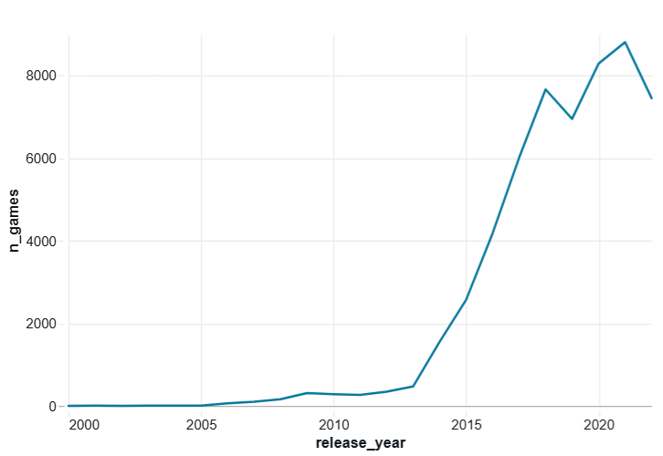
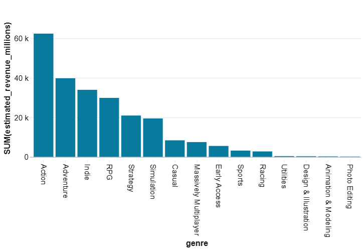

# Steam : analyse du marché des jeux vidéo (Big Data)

Lien GitHub du projet : https://github.com/sandrinehardy/mes_projets_jedha_dsft36/tree/main/Bloc2_Exploratory_Data_Analysis/Steam_Big_Data

## Objectif

Ubisoft veut comprendre le marché des jeux sur Steam pour décider quels jeux développer : quels éditeurs dominent, quels genres sont les plus lucratifs, à quels prix et dans quelles langues sortir, sur quelles plateformes. Le projet analyse un fichier JSON de plus de 55 000 jeux avec PySpark, sur Databricks.

## Données

Fichier JSON stocké sur S3 (bucket du cours), lu avec `spark.read.json`. Le JSON est imbriqué : tout est dans la colonne `data`. Après nettoyage, l'analyse porte sur 55 690 jeux (hors matériel et hors logiciels non classés comme jeux), avec leur éditeur, genres, date de sortie, prix, langues, âge minimum, nombre de propriétaires estimé, avis positifs et négatifs et plateformes.

## Méthode

- Préparation avec PySpark : `select("data.*")`, filtres, conversions de dates et de prix, découpage de la fourchette de propriétaires, calcul du taux d'avis positifs.
- Analyses avec `groupBy`, `agg`, `explode` (un jeu a plusieurs genres), fonction fenêtre (genre favori de chaque éditeur) et `stack` (genres par plateforme).
- Visualisations créées avec l'outil de visualisation de Databricks.

La publication des notebooks n'étant plus disponible sur Databricks, le livrable est le notebook exporté, avec les sorties de cellules et les captures des graphiques.

## Résultats

Les sorties par année montrent une forte croissance du marché : 2 565 jeux en 2015, 8 805 en 2021 (année record). Le Covid n'a pas freiné les sorties : 8 287 jeux en 2020, soit 19 % de plus qu'en 2019.

Le revenu estimé (propriétaires × prix) est le plus élevé pour l'Action, l'Adventure, l'Indie et le RPG. Par jeu, ce sont les jeux massivement multijoueurs, le RPG et l'Action qui rapportent le plus, alors que l'Indie et le Casual sont très nombreux mais rapportent peu par jeu.

Autres résultats :

- Big Fish Games est l'éditeur qui a sorti le plus de jeux (422). Ubisoft est 9e avec 127 jeux.
- Les prix sont bas : 56 % des jeux coûtent moins de 5 et seulement 122 jeux dépassent 60. 4,5 % des jeux sont en promotion.
- L'anglais est présent dans presque tous les jeux, suivi de l'allemand, du français, du russe, du chinois simplifié et de l'espagnol.
- Tous les jeux sont sur Windows, 22,9 % sur Mac et 15,2 % sur Linux.
- Très peu de jeux sont réservés aux adultes (0,5 % interdits aux moins de 16 ans).

Pistes pour Ubisoft : viser les genres qui rapportent le plus par jeu (RPG, Action, multijoueur), prévoir l'anglais en priorité puis le français, l'allemand, le russe, le chinois simplifié et l'espagnol, et sortir sur Windows en priorité.

Limites : le revenu est une estimation à partir de fourchettes de propriétaires, sans les remises ni les achats intégrés ; les totaux par genre se recoupent car un jeu peut avoir plusieurs genres ; les corrélations ne prouvent pas ce qui fait le succès d'un jeu.

## Fichiers

- `SHY_Steam_Big_Data_bloc_2.ipynb` : notebook complet exporté de Databricks (préparation, analyses, graphiques, conclusion)
- `captures/` : captures des 6 visualisations (éditeurs, sorties par année, tranches de prix, camembert des prix, genres, revenu par genre)
