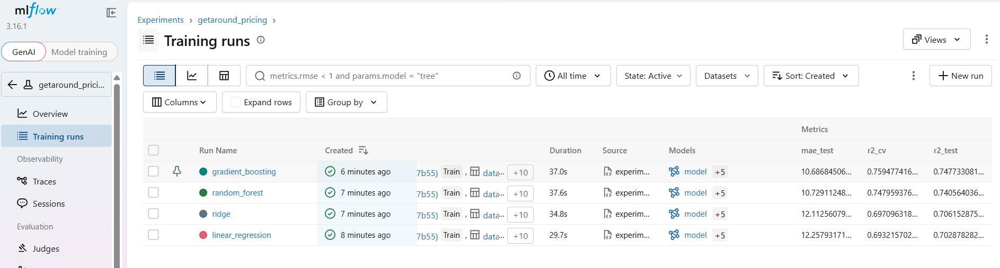

# Comparaison des modèles de prix avec MLflow

Le script `experiments.py` entraîne 4 modèles sur les mêmes données et le même découpage (80 % entraînement, 20 % test), et enregistre chaque essai dans MLflow : paramètres, R² en validation croisée, R² et erreurs sur le jeu de test.

## Résultats

| Modèle | R² (validation croisée) | R² (test) | Erreur moyenne (test) | RMSE (test) |
| --- | --- | --- | --- | --- |
| Régression linéaire | 0,693 | 0,703 | 12,26 € | 18,03 € |
| Ridge | 0,697 | 0,706 | 12,11 € | 17,93 € |
| Random Forest | 0,748 | 0,741 | 10,73 € | 16,85 € |
| **Gradient boosting** | **0,759** | **0,748** | **10,69 €** | **16,62 €** |

Le gradient boosting est retenu pour l'API : c'est le meilleur sur tous les indicateurs, de peu devant la Random Forest. Un modèle qui prédirait toujours le prix moyen se tromperait de 23,6 € par jour en moyenne.



## Lancer les expériences

```bash
conda create -n getaround python=3.12 -y
conda activate getaround
pip install -r requirements.txt
python experiments.py
mlflow ui --backend-store-uri sqlite:///mlflow.db
```

Puis ouvrir http://127.0.0.1:5000 et choisir l'expérience `getaround_pricing`. Les résultats sont enregistrés dans un fichier local `mlflow.db`, non publié sur GitHub.
